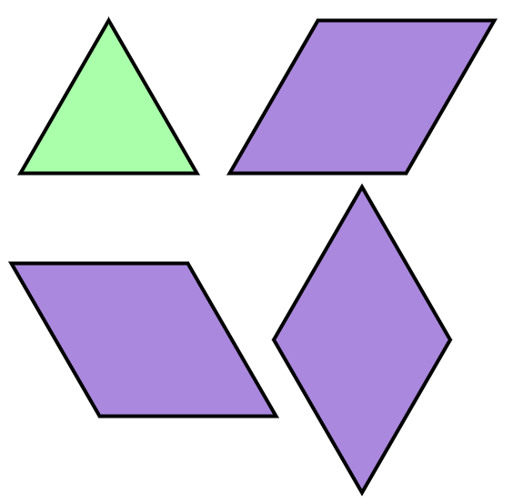

# 산모양 타일링

> 프로그래머스에 https://school.programmers.co.kr/learn/courses/30/lessons/258705 에 들어가시면 푸실 수 있습니다
>> 2024 카카오 인턴 문제

## 풀이 idea:
- index 별로 들어올 수 있는 모양이 어떤 것이 있을까를 잘 생각해보면 된다.

- 순서대로 1, 2, 3, 4 라 했을때
- 2의 평행사변형의 경우 본인 기준(i) 오른쪽 (i + 1)이 3의 평행사변형은 오지 못한다..
  (나머지는 뭐가 오든 상관없다.)
- 또한 4번 마름모는 tops[i]가 1일때만 들어 올 수 있다.

### 위의 제약조건을 바탕으로 풀이하는 것은 어렵지 않다.
- 마름모가 들어 올 수 있는가? 
- 2번의 평행사변형의 경우, 이전에 3번 평행 사변형을 무시하기

위 두개를 바탕으로 구현을 해주면 된다

1. BF
- 시간복잡도를 고려하니 못 풀 것 같았다

- 포기

2. DP
- OPT struct을 가지는가?
- 예. 풀이 코드를 보면 이전 optimal을 바탕으로 새로운 optimal을 구하는 것을 알 수 있다.
- > optimal structure
